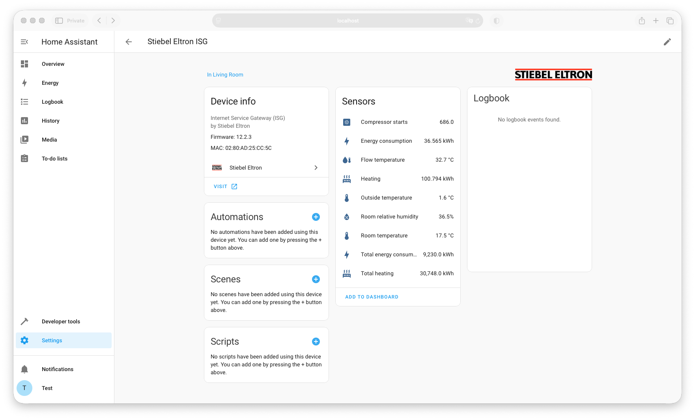
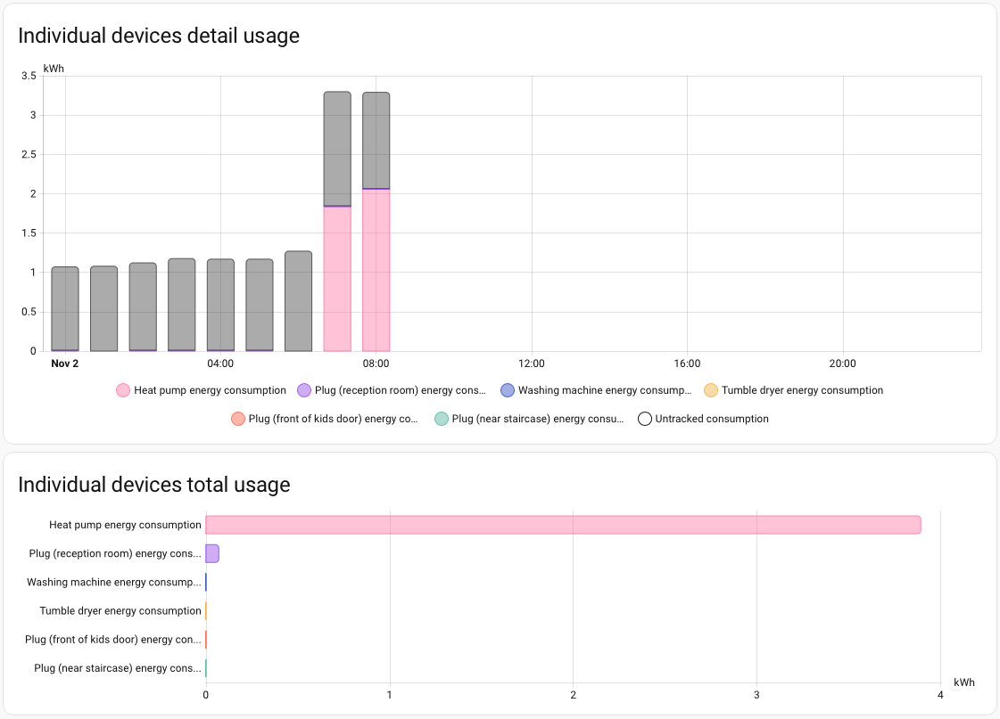

# Stiebel Eltron heat pump integration as Home Assistant sensors
## What it does
Stiebel Eltron HTTP is a Home Assistant integration that connects and scrapes your local Stiebel Eltron ISG webserver to retrieve data from your heat pump system, as HA sensors. See below the provided sensors.

It is not meant to be a climate entity and thus cannot set the temperatures, change the modes, etc. See the official HA integration for that (but know that you'll need to find a way to activate Modbus on your ISG, which might or might not be possible).

This integration is designed to work out-of-the-box and auto-discover your Stiebel Eltron ISG device.

## Prerequisites
- A [Stiebel Eltron heat pump](https://www.stiebel-eltron.com/en/home/products-solutions/renewables/heat_pump.html)
- A [Stiebel Eltron Internet Service Gateway (ISG)](https://www.stiebel-eltron.com/en/home/products-solutions/renewables/controller_energymanagement/isg-web/isg-web.html), connected to your heat pump and your network

## Installation

<b>Using HACS</b>

1. Go to the [HACS](https://hacs.xyz/) section
2. Search and install **Stiebel Eltron** from the HACS store
3. After a few moments, your Stiebel Eltron ISG should be auto-detected, and you can set it up in **Settings / Devices & Services**
4. Otherwise, set it up manually from the same menu, using your ISG IP address

<b>Manually</b>

1. Download this repository;
2. Copy the directory **custom_components/stiebel_eltron_http** to your Home Assistant **config/custom_components/stiebel_eltron_http**
3. Restart HomeAssistant
4. After a few moments, your Stiebel Eltron ISG should be auto-detected, and you can set it up in **Settings / Devices & Services**
5. Otherwise, set it up manually from the same menu, using your ISG IP address

## Provided sensors

- Room temperature
- Room relative humidity
- Outside temperature
- Flow temperature
- Target flow temperature
- Heating produced (daily reset, correctly handled by HA)
- Total heating produced (ever)
- Energy consumption (daily reset, correctly handled by HA)
- Total energy consumption (ever)
- Compressor starts
- Compressor status (on/off)
- Auxiliary heater status (on/off)
- Booster heater status (on/off)
- Defrost status (on/off)

With the **Energy consumption** sensor, you can add this precious data to your Energy dashboard, to monitor the individual consumption by your heat pump. See below for example screenshots.

## Screenshots

